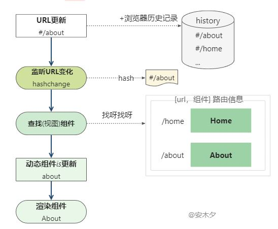

### Vue Router
实现单页面应用的基础就是ajax ，通过一步请求动态的切换页面内容，实现交互，整体页面也没有刷新。
SPA(single page application)的主要表现就是更新视图而不重新请求页面，要实现前段的页面的自主路由控制，而不会刷新页面 ，设计hash 模式和history 模式。

1. hash 模式
hash就是URL中#后面的内容，改变hash值，页面就会发生变化，hash模式的特点就是简单，兼容性好，但是hash值不能包含#，所以不能使用一些功能，比如后退按钮。
- 以页面不刷新： hash 变化不会刷新页面，只会出发浏览器的定位锚点
- 获取hash :  window.location.hash
- hash 变更时间： window.hashchange 监听hash 变化
- 不同的hash 会进入浏览器历史记录。

2. history 模式
- history 是历史对象，存放当前的文档页面的回话历史记录（不是浏览器的所有历史记录）。
- popstate 事件：当state变化触发是，在事件中获取当前的url地址。pushstate,replaceState 方法并不会出发popstate 事件。