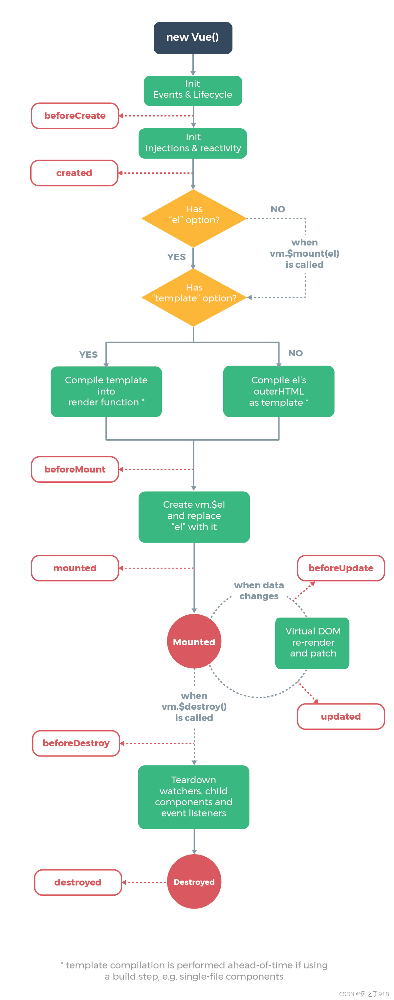

# Vue2.0 学习笔记

### 起步
vue2 与 vue3 相同，每个vue 应用都需要用过实例化vue 来实现
```javascript
    var vm = new Vue({
        //选项
    })
```

**实例**（展示vue 构造器中需要的内容）：
```javascript
    <div id="vue_det">
    <h1>site : {{site}}</h1>
    <h1>url : {{url}}</h1>
    <h1>{{details()}}</h1>
</div>
<script type="text/javascript">
    var vm = new Vue({
        el: '#vue_det',
        data: {
            site: "菜鸟教程",
            url: "www.runoob.com",
            alexa: "10000"
        },
        methods: {
            details: function() {
                return  this.site + " - 学的不仅是技术，更是梦想！";
            }
        }
    })
</script>\
```     
Vue构造器中的el 参数是DOM元素中的ID，data 选项是vue实例的数据对象，methods 选项是vue实例的方法对象。

### 模板语法
**文本插值**
数据绑定最常用的就是双大括号的文本插值
```html
    <div id="app">
        {{ message }}
    </div>
```

**v-html**
```html
通过v-html输出html 代码
<div id = "app">
    <div v-html="message"></div>
</div>

<script>
    new Vue({
        el: '#app',
        data: {
            message: '<h1>This is a title</h1>'
    }
})

</script>
```
**v-show**
v-show指令可以用来动态的控制DOM元素的显示或隐藏。v-show的表达式结果为true时，元素将被渲染，为false时，元素将被移除。

**实例**
如果将Vue中的flag令为false，则图片将不会显示。
```html
<!DOCTYPE html>
<html lang="en">
<head>
    <meta charset="UTF-8">
    <meta name="viewport" content="width=device-width, initial-scale=1.0">
    <meta http-equiv="X-UA-Compatible" content="ie=edge">
    <title>v-show指令</title>
    <!--引入vue.js-->
    <script src="node_modules/vue/dist/vue.js" ></script>
    <script>
       window.onload=function(){
           // 构建vue实例
           new Vue({
               el:"#my",
               data:{
                      flag:true,//布尔型
                      imgList:["img/banner1.jpg","img/banner2.jpg","img/banner3.jpg"]
               },
               // 方法
               methods:{
 
               }
           })
       }
    </script>
</head>
<body>
    <div id="my">
         <ul>
             <li v-for="list in imgList">
                 
             </li>
         </ul>
    </div>
</body>
</html>
```

其余的指令，如v-if、v-for、v-on、v-bind等，都与vue3 相同。

### 生命周期钩子
所有生命周期钩子的this上下文将自动绑定在实例中，所以你可以访问data,computed和methods，所以你**不应该使用箭头函数来定义一个生命周期方法**，因为箭头函数绑定了父级作用域的this，导致this不能正确指向vue实例。

- beforeCreate:在实例初始化之后，进行数据侦听和事件侦听器的配置之前同步调用，只是组件的data, method并未绑定到this 实例上，访问不到。

- created:在实例创建完成后调用，此时实例已经完成了数据观测(data observer)，属性和方法的运算，watch/event 回调。也就是说data 和 methods 选项中的数据是可以访问的。

- beforeMount:在挂载开始之前调用，相关的 render 函数首次被调用，页面此时仍没有dom结构,此时页面还是旧的

- mounted: 模板已经挂载到了页面上，整个Vue 实例已经准备就绪，可以通过默写插件操作页面上的DOM 节点。

- beforeUpdate:数据更新时调用，DOM被更新之前调用，此时页面现实的数据还是旧的，data数据是新的，页面尚未与最新的数据保持同步。

- updated：页面和data中的数据保持同步，是最新的。

- beforeDestroy:实例身上所有的method 和data  以及过滤器，指令都还可以用，开启的定时器都可以在此停止。

- destroyed:实例销毁后调用，此时实例已经解除了事件侦听器，所有的指令都被解除绑定，所有的子组件也被销毁，所有的定时器都被清除。



**父子组件生命周期区别**
- 创建顺序：父组件先被创建，意味着父组件的beforeCreate 和 created 钩子函数会先于子组件执行。
- 数据传递：父组件向子组件传递数据，只能通过props，子组件通过props接收数据。
- 更新顺序：父组件更新时，会先于子组件执行beforeUpdate 和 updated 钩子函数，子组件更新时，会先于父组件执行beforeUpdate 和 updated 钩子函数。
- 销毁顺序：父组件销毁时，会先于子组件执行beforeDestroy 和 destroyed 钩子函数，子组件销毁时，会先于父组件执行beforeDestroy 和 destroyed 钩子函数。

### Props
一个组件需要显式声明他所接受的props，这样vue 才能知道外部传入的那些是props，哪些是attributes.
props 可以使用defineProps 或者 props 来定义.

```javascript
//在使用<script setup>的单文件组件中，可以使用defineProps来定义props
<script setup>
const props = defineProps(['foo'])

console.log(props.foo)
</script>
```
或者
```javascript   
export default {
    props: ['foo']
    setup(){
        console.log(props.foo)
    }
}
```
父组件可以通过Props向子组件传递数据，子组件通过props接收数据。
```html
<template>
  <div>
    <blog-post title="My journey with Vue" /></blog-post>
  </div>
</template>


<script>
    Vue.componenet('blog-post',{
        props:['title']
        template:'<div><h1>{{title}}</h1></div>'
    })
</script>
```
可以简单的讲props 理解为vue组件之间的一种通信方式，通过Props,父组件可以向子组件传递数据，组件可以通过组件标签上的属性值把数据传递到子组件中，子组件可以根据自己的属性和方法去渲染展示数据或执行某些操作。

使用props 需要进行一下几个步骤：
- 在组件选项中声明props:
```javascript
    props:{
        propA: String,
        propB:{
            tyoe:Number,
            required:true,
        },
        propC: {
            type:[String,Number],
            default: 'default value'
        }
        
    }
```

- 在组件的模板中使用props:
```html
    <template>
        <div>
            <p>Prop A: {{ propA }}</p>
            <p>Prop B: {{ propB }}</p>
            <p>Prop C: {{ propC }}</p>
        </div>
    </template>
```

- 在父组件中通过绑定属性的方式传入props:
```html
    <template>
        //这里valueA和valueB是传入props 的实际值
        <my-component prop-a="valueA" :prop-b="valueB"></my-component>
    </template>
```

**props的使用场景**
当我们需要在父组件和子组件之间进行数据传递时，就可以用props。比如一个商品列表页面中，可以定义一个ProductList的父组件，子组件ProductItem 可以通过props 接受父组件传递过来的产品信息，用于渲染商品列表。

- 在父组件ProducaList中定义一个产品列表，然后使用v-for里边产品列表，将每一个产品作为一个子组件ProductItem 的product props传递给子组件。
```html
<template>
  <div>
    <ProductItem v-for="product in products" :key="product.id" :product="product" />
  </div>
</template>

<script>
import ProductItem from './ProductItem.vue'
export default {
  components: {
    ProductItem
  },
  data() {
    return {
      products: [
        {
          id: 1,
          name: 'Product A',
          price: 100,
          description: 'This is product A'
        },
        {
          id: 2,
          name: 'Product B',
          price: 200,
          description: 'This is product B'
        }
      ]
    }
  }
}
</script>

```

- 在子组件ProductItem中,通过props 对象声明一个名为product 的props，然后通过模板插值，将父组件传递过来的产品信息进行渲染：
```html
<template>
  <div>
    <h2>{{ product.name }}</h2>
    <p>{{ product.description }}</p>
    <p>Price: {{ product.price }}</p>
  </div>
</template>
<script>
export default {
  props: {
    product: {
      type: Object,
      required: true
    }
  }
}
</script>

```
在这个例子里，父组件ProductList将产品列表products 传递给子组件ProdcutItem的product props, 子组件ProductItem接受并渲染产品信息。

### 自定义事件
父组件可以通过自定义事件来触发子组件的事件，子组件可以通过$emit 触发自定义事件。

- 在父组件中，通过$emit 触发自定义事件：
```html
<template>
  <div>
    <button @click="$emit('my-event', 'hello world')">Click me</button>
  </div>
</template>
```


