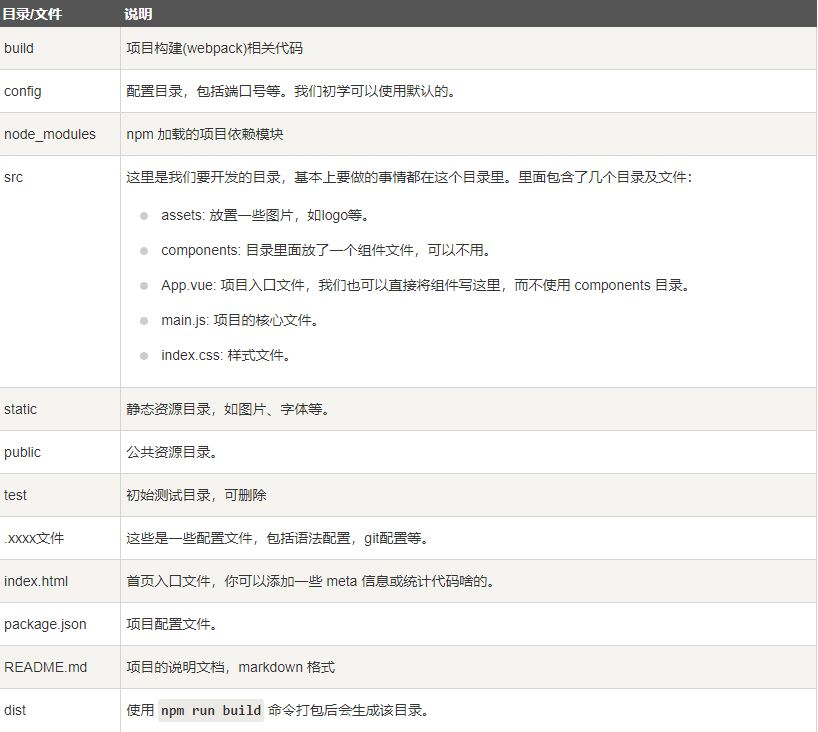

# Vue3 学习笔记

### 项目目录解析


### vue 起步
vue中的项目都是通过createApp函数来创建，选项用于配置根组件
```JavaScript
    const app = Vue.createApp({/*选项 */})
```

实例应用：
```JavaScript
    Vue.createApp({HelloApp}).mount('#hello-vue')
```
HelloApp 作为根组件，挂在应用时作为渲染起点。应用需要被挂载在一个DOM 元素中，mount()将这个vue 应用挂载到 id 为 hello-vue的DOM元素上。

```JavaScript
<div id="hello-vue" class="demo">
  {{ message }}
</div>
​
<script>
const HelloVueApp = {
  data() {
    return {
      message: 'Hello Vue!!'
    }
  }
}
​
Vue.createApp(HelloVueApp).mount('#hello-vue')
</script>
```
这里的data选项作为一个函数，vue 在创建新组件过程中调用此函数，这个函数的返回对象会被包裹起来，以$data的形式储存在组件里。

```Javascript
const app = Vue.createApp({
    data(){
        return {count:4}
    }
})

const vm = app.mount('#app')

document.write(vm.$data.count) // 输出为4
```

### 方法

在组件里添加方法使用method选项。
```javascript
const app = Vue.createApp({
    data(){
        return {count:4}
    }

    methods: {
        incerment(){
            //这里的this 与java 中的用法相似，都是指向该对象
            this.count++  
        }
    }
})

const vm = app.mount('#app')

document.write(vm.count) // 输出为4

vm.incerment() 

document.write(vm.count) //输出5
```

### 指令
- v-bind 用于将Vue实例的数据绑定到HTML元素上
- v-if 与其它语言作用相似
- v-show 根据表达式的值来条件下的显示隐藏元素
- v-for 与其它语言作用相似
- v-on 用于绑定事件(onclick, oninput等)
- v-model 用于双向数据绑定

**实例**
v-model:
v-model 指令可以实现数据的双向绑定，即视图改变时，数据也会跟着改变，反之亦然。可以理解为先做v-bind，再做v-on。
```javascript
<div id="app" class="demo">
    <input type="text" v-model="message">
    <p>{{message}}</p>
</div>
​
<script>
    const HeeloVueApp = {
        data() {
            return {
                message: 'Hello Vue!!'
            }
        }
    }
    /*HelloVueApp 作为根组件，挂在应用时作为渲染起点,mount()将这个vue 应用挂载到 id 为 app的DOM元素上*/ 
    Vue.createApp(HelloVueApp).mount('#app')
</script>
```

v-bind:
```javascript
//通过vue 从data中获取数据，并绑定到img标签的src属性上
<div id="app" class="demo">
    
</div>
​
<script>
    const HelloVueApp = {
        data(){
            return{
                imgUrl: 'https://cn.vuejs.org/images/logo.png'
            }
        }
    }
    Vue.createApp(HelloVueApp).mount('#app')
```

### 组件
组件可以扩展HTML 元素，封装可重用的代码，组件让我们可以使用那些可以服用的小组件来构建大型应用。

注册一个全局组建的语法如下：
```javascript
const app = Vue.craeteApp({
    app.component('my-component-name', {
        /*组件选项 */
}
})
``` 
my-component-name 就是组件的名字，组件选项包含三个部分：
- template：组件的HTML 模板
- data：组件的状态数据
- methods：组件的方法

**创建vue组件实例**
```javascript
<div id = "app">
    <runnob></runnob>

</div>
​
<script>
    const app = Vue.createApp{()}
    
    //注册全局组件runoob，并挂载到id为app的DOM元素上，
    app.component('runoob',{
        //这三个元素都是组件的选项
        template: '<div>这是runoob组件</div>',
        data(){
            return{
                message: 'Hello Vue!!'
            }
        },
        methods: {
            incerment(){
                this.count++  
            }
        }
    })

    app.mount('#app')
    
</script>
```

### 计算属性
计算属性关键词： computed，主要用于处理一些复杂逻辑。计算属性表明此属性有计算能力，也就相当于一个函数，可以将计算结果缓存起来，避免每次调用都重复计算。

计算属性的 getter 和 setter 方法可以用来自定义计算逻辑。
计算属性会自动更新求值，只要计算源数据任何一项发生了变化，计算属性都会立刻更新，实现动态计算。记住这个属性要在methods:{}或者computer:{}中以函数的方法定义。
**实例**
```javascript
<!DOCTYPE html>
<html>
<head>
<meta charset="utf-8">
<title>Vue 测试实例 - 菜鸟教程(runoob.com)</title>
<script src="https://cdn.staticfile.org/vue/3.0.5/vue.global.js"></script>
</head>
<body>
<div id="app">
  <p>原始字符串: {{ message }}</p>
  <p>计算后反转字符串: {{ reversedMessage }}</p>
</div>
    
<script>
const app = {
  data() {
    return {
      message: 'RUNOOB!!'
    }
  },
  computed: {
    // 计算属性的 getter
    reversedMessage: function () {
      // `this` 指向 vm 实例
      return this.message.split('').reverse().join('')
    }
  }
}
 
Vue.createApp(app).mount('#app')
</script>
</body>
</html>
```
在这个例子中，我们定义了一个计算属性 reversedMessage，它依赖于 message 变量。当 message 发生变化时，reversedMessage 也会随之变化。

### 监听属性
watch选项可以用来监听数据的变化，当监听的数据变化时，会自动调用相应的函数。

**实例**
```javascript
<div id = "app">
    <p style = "font-size:25px;">计数器: {{ counter }}</p>
    <button @click = "counter++" style = "font-size:25px;">点我</button>
</div>
   
<script>
const app = {
  data() {
    return {
      counter: 1
    }
  }
}
vm = Vue.createApp(app).mount('#app')
vm.$watch('counter', function(nval, oval) {
    alert('计数器值的变化 :' + oval + ' 变为 ' + nval + '!');
});
</script>
```
在这例子中，watch主要用于监听counter变量的变化，当counter变量发生变化时，会自动调用alert函数，并显示变化前后的值。

### 样式绑定
class 和 style 指令可以用来绑定HTML元素的类和样式, 我们可以用v-bind来设置样式属性.

**实例**
```javascript
<!DOCTYPE html>
<html>
<head>
<meta charset="utf-8">
<title>Vue 测试实例 - 菜鸟教程(runoob.com)</title>
<script src="https://cdn.staticfile.net/vue/3.0.5/vue.global.js"></script>
<style>
.active {
    width: 100px;
    height: 100px;
    background: green;
}
</style>
</head>
<body>
<div id="app">
    // 绑定 class 属性
    <div :class="{ 'active': isActive }"></div>
</div>

<script>
const app = {
    data() {
      return {
         isActive: true
      }
   }
}

Vue.createApp(app).mount('#app')
</script>
</body>
</html>
```
这个例子将isActive 设置为true 显示了一个绿色的div 块，如果设置为false则不显示

### Vue 自定义指令
除了默认设置的核心指令，Vue还可以注册自定义指令。

**实例**
注册一个全局指令v-focus，这个指令是在页面加载时，自动获取焦点。
```javascript
<div id="app">
    <p>页面载入时，input 元素自动获取焦点：</p>
    <input v-focus>
</div>
 
<script>
const app = Vue.createApp({})
// 注册一个全局自定义指令 `v-focus`
app.directive('focus', {
  // 当被绑定的元素挂载到 DOM 中时……
  mounted(el) {
    // 聚焦元素
    el.focus()
  }
})
app.mount('#app')
</script>
```

### Vue 混入
混入（Mixin）是一种扩展组件选项的机制。通过混入，可以将多个组件选项合并为一个，使得代码更加灵活。

